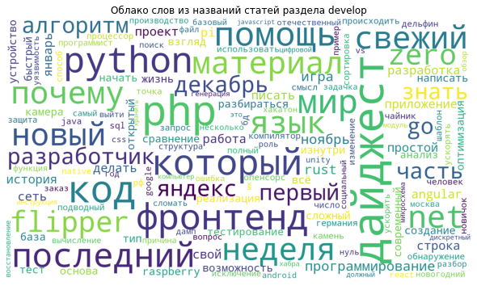
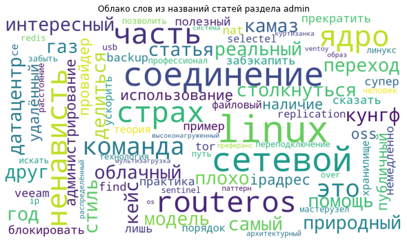
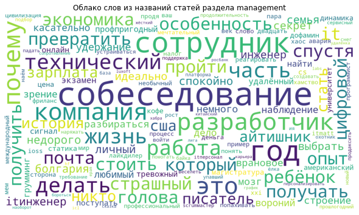
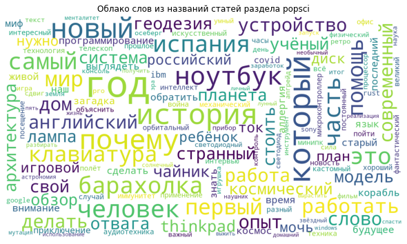
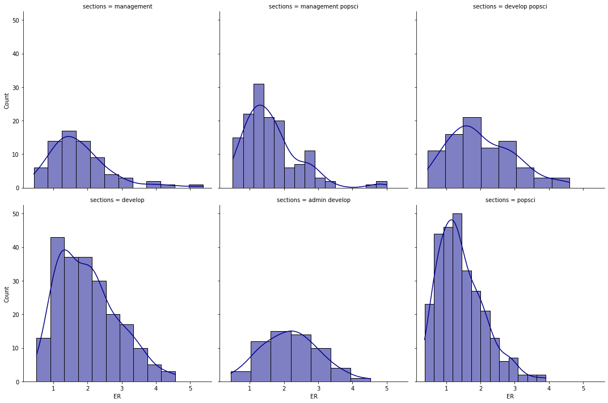
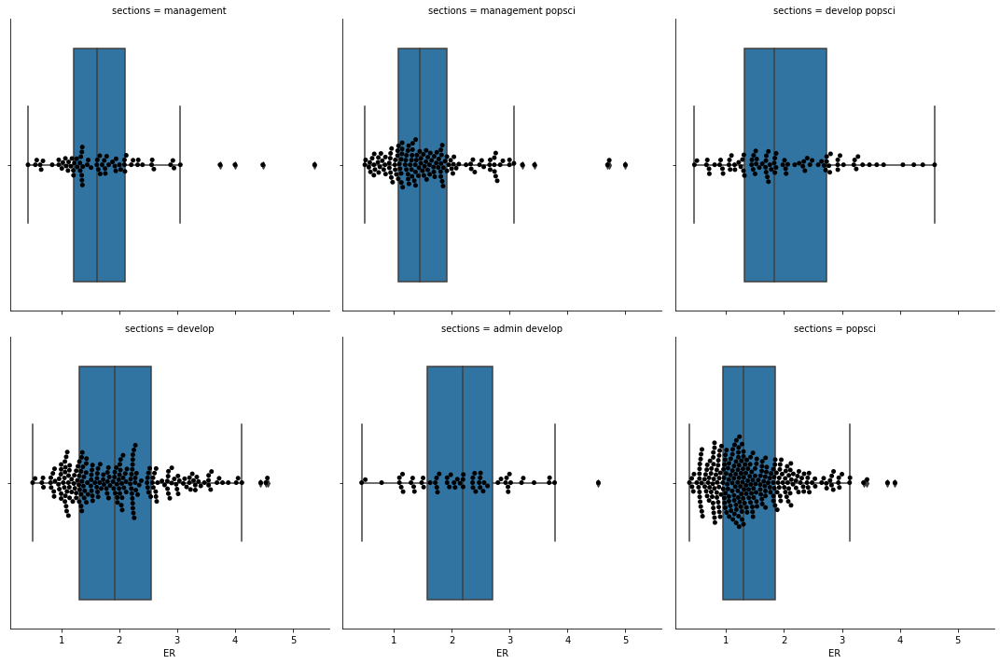

# Парсинг и анализ данных с [habr](https://habr.com/ru/all/)
## Построение облака слов
Облака слов были построены из названий статей различных разделов habr'а. 
Облака слов показывают самые популярные слова в тексте, что позволяет быстро оценить
тематику текста. В данном случае мы можем одним взглядом выяснить, какие технологии
популярны в той или иной сфере ИТ.

## Вычисление рейтинга вовлечённости

где 

PV — количество положительных оценок;

NV — количество негативных оценок;

BM — количество добавлений в закладки;

CN — количество комментариев;

V — количество просмтотров.

Распределение ER статей по комбинациям разделов (учитывались только комбинации, где опубликовано больше 50 статей за 3 месяца).
Данный график позволяет нам определить, статьи из каких разделов интересуют читателей больше всего.

График boxplot позволяет более подробно изучить распределение статей по ER, а также выявить аномалии.

## Корреляционный анализ
Корреляционный анализ выявил, что статьи раздела "Разработка" имеют слабую положительную корреляцию с ER,
а статьи раздела "Научпоп" имеют слабую отрицательную корреляцию. Оценка проводилась по шкале Чеддока.

| Раздел     | Корреляция с ER |
|------------|-----------------|
| develop    | 0.212234        |
| marketing  | 0.104708        |
| design     | 0.096666        |
| admin      | 0.038734        |
| management | -0.061760       |
| popsci     | -0.202195       |